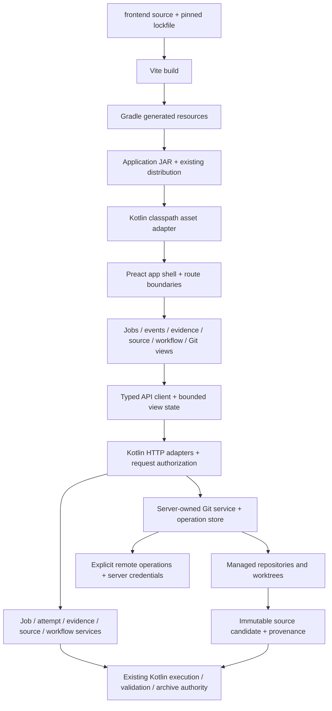

# Embedded workbench architecture

Decision authority: [#146](https://github.com/minsago-elite/decomp_thing/issues/146),
within [D0](https://github.com/minsago-elite/decomp_thing/milestone/26).
This records implementation decisions, not delivered SPA functionality. The
inspected baseline is `27feba3`: Kotlin 2.4.0, JDK 21, Gradle wrapper 9.6.1,
`UploadServer`, `JobStore`, server-rendered `WebViews`, and the existing thin-JAR
application distribution. There is no frontend build or packaged SPA at that
baseline. Live status and acceptance evidence remain in GitHub issues.

The [parity contract](web-parity.md) defines behavior to preserve, the
[API contract](web-api.md) owns wire schemas, and the
[browser trust contract](web-trust.md) owns authorization and content boundaries.
The [delivery contract](web-delivery.md) owns qualification profiles and budgets.
These decisions must not change existing reconstruction, validation or archive
acceptance authority.

## Toolchain and dependency decision

Use Preact with TypeScript, Vite, `preact-iso` routing, native browser fetch and
Preact hooks/context. The official Preact setup supports Vite, while its TypeScript
support supplies Preact's own component types and automatic JSX runtime. Configure
`jsx: "react-jsx"` and `jsxImportSource: "preact"`; the JSX option name does not
require React. [Preact setup](https://preactjs.com/guide/v10/getting-started/),
[Preact TypeScript](https://preactjs.com/guide/v10/typescript/).

The selected initial pins were checked against published package metadata on
2026-09-05. D1 must prove the combination with a locked install, type check,
component smoke test and production build; metadata compatibility alone is not
that proof. Exact transitive versions belong in `frontend/package-lock.json`.

| Layer | Initial exact version | Decision |
| --- | --- | --- |
| Node / npm | 24.20.0 / 11.19.0 | Pinned build-only LTS toolchain; runtime needs neither |
| UI | `preact` 10.29.8 | Native Preact components/hooks; MIT |
| Router / lazy boundary | `preact-iso` 2.12.2 | Preact-maintained router, route parameters, history and async transitions; MIT |
| Router peer | `preact-render-to-string` 6.7.0 | Explicitly satisfy the router's declared peer; browser imports must tree-shake prerendering out; MIT |
| Bundler / preset | `vite` 8.2.2 / `@preact/preset-vite` 2.10.6 | Build and development only; MIT |
| Type checker | `typescript` 6.0.3 | Compatible with the selected lint parser; Apache-2.0 |
| Lint | `eslint` 10.10.0, `@eslint/js` 10.0.1, `typescript-eslint` 8.69.0 | Focused TypeScript correctness/import rules; build only |
| Component/state tests | `vitest` 4.1.11, `jsdom` 30.0.1, `@testing-library/preact` 3.2.4 | Native Preact tests with accessible DOM queries; build only |
| Preset declaration types | `@types/babel__core` 7.20.5 | Required to check preset declarations without suppressing library errors; build only |
| Node configuration types | `@types/node` 24.13.3 | Configuration/tests only; match supported Node major |
| Packaged browser tests | `@playwright/test` 1.63.0 | D12 browser driver and its pinned browser revisions; test only |

Node's release policy distinguishes LTS from Current; the selected Node release
ships npm 11.19.0. Vite requires Node 20.19+ or 22.12+, so the selected Node 24 pin
satisfies that requirement. TypeScript 7 is deliberately not selected because
the chosen lint tooling documents support below 6.1.
The D1 locked-build check selected Vitest 4.1.11 after 5.0.0's published
declarations failed strict checking; the verified pins and bundle measurements are
recorded in [the frontend workspace](../frontend/README.md) and
[bundle evidence](../frontend/BUNDLE.md).
[Node release policy](https://nodejs.org/en/about/previous-releases),
[Node 24.20.0 checksums](https://nodejs.org/download/release/v24.20.0/SHASUMS256.txt),
[bundled npm metadata](https://github.com/nodejs/node/blob/v24.20.0/deps/npm/package.json),
[Vite requirements](https://vite.dev/guide/),
[typescript-eslint compatibility](https://typescript-eslint.io/users/dependency-versions/).

`preact-iso` provides routing, lazy loading and an error boundary together. Import
the router/lazy subpaths where useful; do not enable prerendering, hydration or a
Node application server. Browser back/forward, direct load, encoded identifiers,
query preservation and base-path behavior are application tests even when the
router library supports them. Its use avoids implementing a second routing state
machine inside the workbench. [Official router documentation](https://github.com/preactjs/preact-iso).

No React, React DOM, React compatibility import, UI framework, icon font, global
query cache, Redux, signals package, HTTP client or browser Git package is required.
Disable preset React aliases where supported and reject accidental production
imports of compatibility/SSR modules in the bundle report. Native CSS, local SVG
icons and a system font stack are the initial visual assets. An editor, graph,
syntax highlighter or virtualization package needs a focused dependency review
before adoption; it must have a measured advantage over the existing bounded
text/list views. The Preact preset is a build integration, not runtime authority.
[Preset configuration](https://github.com/preactjs/preset-vite).

All direct versions are exact, npm's lockfile is committed, and installation uses
`npm ci`. Record the same Node pin in `.node-version` and package engine metadata,
and the npm pin in `packageManager`; CI and Gradle check the actual tools before
building. Updates change the pin and lockfile together in a focused commit.
Review license/notices, maintainer and release provenance, advisories, install
scripts, peer requirements, transitive additions and production byte impact.
Required install scripts are reviewed explicitly; release builds must not silently
download an unpinned browser or tool. Dependency changes rerun the component,
bundle and packaged asset gates. Do not use unbounded `latest`, Git branch
dependencies or a CDN to bypass the lockfile.

## Files, resources and launch contract

| Concern | Chosen location/identity |
| --- | --- |
| Frontend source/config/lockfile | `frontend/` |
| HTML input / browser entry | `frontend/index.html` / `frontend/src/main.tsx` |
| Vite output | `build/frontend/dist/`; never checked in |
| Vite configuration | `base: './'`, `build.assetsDir: 'assets'`, `build.manifest: true` |
| Build manifest | `build/frontend/dist/.vite/manifest.json`; HTML entry key `index.html` |
| Staged generated resources | `build/generated/frontend-resources/decompengine/web/ui/` |
| Reserved classpath namespace | `/decompengine/web/ui/` |
| Public emitted asset namespace | `<basePath>/assets/ui/`; for example `/assets/ui/assets/index-HASH.js` |
| Production UI entry | Existing `llm_bin_patch web`; recognized UI GET/HEAD routes render the shell |
| API namespace | `<basePath>/api/v1/`; legacy compatibility remains separately owned |

The application JAR contains the frontend output. It is different from a job's
`source-tree.zip`; frontend files must never enter reconstructed source archives.
The distribution remains a thin JAR with its existing runtime dependencies and
native helpers. This decision does not introduce `java -jar`, a fat JAR, SSR or an
external production web server.

Gradle owns the sequence `frontendInstall -> frontendBuild -> stageFrontend ->
processResources -> jar`. Install inputs include tool versions, package metadata,
lockfile and install policy. Build inputs include source, configuration, public
assets, the lockfile and tool identity; outputs are declared generated directories.
Use `Sync` for staging so deleted chunks cannot remain in later archives; fail
duplicate resources. `clean` deletes outputs, never the lockfile. Gradle's input
and output declarations provide incremental invalidation, and `Sync` removes
destination files absent from the input. [Gradle incremental build](https://docs.gradle.org/current/userguide/incremental_build.html),
[Gradle Sync](https://docs.gradle.org/current/dsl/org.gradle.api.tasks.Sync.html).

`jar`, `installDist`, `distZip` and `distTar` reach that same resource-producing
chain; no manual frontend prebuild is allowed. Frontend compilation must not
depend on `jar`, `test` or generated JVM closure references. The existing
`stageKotlinBootRuntime` and hosted-worker reference generation continue to consume
the final JAR after assets are embedded. D1 verifies unchanged native-helper and
classpath-reference contracts and checks archive tasks for dependency cycles.
Content hashes identify build-produced assets; reproducible UI bytes, JAR entries
and authenticated runtime closure records remain separate verification claims.

## Serving and development

Keep production same-origin: Kotlin serves shell HTML, trusted assets, APIs,
events and authorized downloads. The static adapter reads classloader streams,
including real `jar:` resources; it never converts resource URLs to filesystem
paths. At startup, resolve the `index.html` manifest entry and recursively validate
its static/dynamic imports and related emitted resources. Missing entries, unsafe
names, duplicate mappings and missing bytes fail readiness with a clear operator
error. Explicitly include worker/font/icon outputs in the packaged resource
inventory because not every emitted auxiliary asset is necessarily an entry in
Vite's module manifest.

Only known emitted resources can be requested under `/assets/ui/`. The manifest
and packaged `index.html` are private startup inputs, not arbitrary resource
lookup endpoints. The server creates the public shell using the manifest's script
and CSS filenames, with escaped base-path metadata for the browser entry. There
is no inline executable bootstrap or `<base>` tag. The server must not accept
module filenames from requests. Vite's manifest records entry output filenames,
imports and CSS for backend lookup. [Vite backend integration](https://vite.dev/guide/backend-integration).

Vite's relative base keeps imports and worker URLs relative to emitted modules.
Kotlin prefixes manifest entry URLs with the configured normalized base path and
`/assets/ui/`. A central frontend URL helper uses that same bootstrap base path for
routes, fetch, event streams and downloads. This permits `/` and configured nested
deployment paths without rebuilding assets. Worker modules use static
`new URL('./worker.ts', import.meta.url)` references so the bundler can discover
and hash them; no blob/eval worker, CDN or uploaded code is permitted. Production
source maps stay outside public assets. [Vite worker assets](https://vite.dev/guide/features.html#web-workers),
[Vite public base path](https://vite.dev/guide/build.html#public-base-path).

Asset/API/download route matching precedes SPA fallback; only recognized UI routes
receive HTML. Unknown assets and APIs retain typed errors, never successful shell
responses. HTML/bootstrap/session responses use `no-store`; content-hashed assets
use immutable caching with validators. D1 tests GET/HEAD, conditional requests,
missing chunks, trailing slashes, dotted names, encoded paths and configured
base paths. An old tab whose lazy chunk disappeared gets a recoverable deployment
notice and an explicit reload control; it never auto-replays mutations or loops
through reloads. Do not preload every feature route to hide missing split assets.

For development, Vite binds loopback and proxies API/event/download requests to
the JVM. The browser uses a single configured development public origin and base
path. The explicitly enabled development adapter configures Kotlin for that exact
public origin; the proxy preserves the browser Host/Origin and streaming/cookie
semantics instead of stripping origin checks or enabling wildcard CORS. Startup
session links use the development public origin. Production rejects development
origin/forwarding configuration. Mock mode uses deterministic DTO fixtures through
the same client interface and displays a fixture indicator; it cannot use live
credentials or make mutations against a production server. D1's proxy tests own
this separation and verify no buffering of event streams (#155).

## Module and authority boundaries

| Frontend module | Owns | Must obtain through a typed boundary |
| --- | --- | --- |
| `app/` | Layout, router, navigation focus, capability/session context, top-level boundary | Sanitized bootstrap and route identity |
| `jobs/` | Dashboard, upload form, overview, organization views | Job pages and explicit job mutations |
| `events/` | Event client, bounded reducer, reconnect/snapshot reconciliation, activity/log views | Durable cursor, run snapshot and bounded log pages |
| `evidence/` | Structures, scores, diagnostics, provenance and comparison presentation | Versioned evidence projections and honest availability states |
| `sources/` | Lazy tree, bounded text/search, file/revision selection, artifact catalog | Immutable revision/file/artifact IDs and bounded content |
| `workflows/` | Launch/preflight forms, pending operation states, revision review | Server capabilities, operation receipts and validation outcomes |
| `git/` | Repository overview, changes, history, branches/worktrees, remotes and conflicts | Repository/worktree/ref/operation APIs and immutable provenance |
| `api/` | DTO decoding, URL construction, fetch/errors, timeout/abort, session/CSRF attachment | Wire schemas; no DOM or feature rendering |
| `shared/` | Accessible forms, notices, tables, tabs, dialogs, pagination and text panes | Typed props and events; no hidden network or workflow execution |

Each feature owns small controller hooks and pure view-model transforms, with
components consuming typed props. Import shared primitives/API definitions instead
of another feature's private component state. Route modules load lazily; source,
graph, large diff and optional provider UI load only when opened. Shared utilities
must not import all feature modules back into the initial bundle.

On the JVM, HTTP adapters parse requests, apply authorization, invoke services and
serialize DTOs. Reusable job/workflow services own atomic lifecycle transitions,
admission and persistence; report adapters expose bounded projections of existing
authoritative evidence. Source/artifact services own immutable file resolution,
containment and streaming. Domain services take logical IDs and typed requests,
not `HttpExchange`, HTML or browser-selected host paths. The existing injectable
`JobAnalyzer`, `JobReconstructor` and executor are useful migration seams, not a
reason to leave scheduling or file policy inside route handlers.

The server-owned Git service wraps a bounded Git adapter and durable operation
store. Its typed surface distinguishes `repositoryId`, `worktreeId`, `operationId`,
`refId`, opaque `objectId` plus `objectFormat`, and reconstruction `revisionId`.
Mutations carry expected repository/worktree/ref versions and return operation
receipts; status/history/diff are bounded reads. The adapter alone resolves managed
roots, selects the executable/argv, controls imported config/hooks/filters,
accesses credential handles and starts/cancels Git. Browser Git views display
sanitized results and submit explicit typed intents; they never receive raw
commands, host paths or credentials. Git commit identity is recorded alongside
source/archive provenance and never substitutes for reconstruction acceptance.
Remote integration produces source candidates that return through existing
validation. Optional provider PR views depend on a separately advertised provider
capability, not on core local Git availability (#200–#215).

## State, errors and test seams

| State class | Owner and lifetime | Rules |
| --- | --- | --- |
| Server state | Kotlin job/attempt/revision/event/operation stores | Browser holds bounded snapshots/pages, reconciles by identity/version, and never infers acceptance from a completed progress bar |
| URL state | Router plus typed parse/serialize helpers | Job, run, immutable revision/file, repository/worktree, selected tab, shareable filters/sort/cursor; back/forward restores the same scope |
| Transient view state | Local hooks/reducers; feature context only when shared | Dialog visibility, dirty form draft, selected rows, expanded nodes and request lifecycle; clear or reconcile on identity change |
| Persisted preferences | Small versioned localStorage record | Theme, density, wrapping and pane preferences only; bounded values with validation and reset; unavailable storage is recoverable |

Tokens, sessions, CSRF material, source/log bodies, private prompts and job/workflow
truth never enter localStorage. In-flight request deduplication and AbortController
belong in the feature/controller client, with stale-response guards keyed by
job/run/revision. Event buffers have fixed limits; cursor gaps trigger a bounded
snapshot refresh. Mutations return receipts and invalidate affected snapshots;
navigation, rerendering or reconnecting cannot dispatch a workflow.

No extra state/query library is justified by the initial scope: hooks/reducers and
explicit bounded query lifetimes expose the required ownership without a second
global cache. Reconsider only after profiling duplicated cache/retry/invalidations
and documenting a concrete correctness or maintenance benefit, bundle delta and
tests for immutable revision and event-gap semantics.

TypeScript uses `strict`, `noUncheckedIndexedAccess`,
`exactOptionalPropertyTypes`, `noImplicitOverride`, `noFallthroughCasesInSwitch`,
`noUnusedLocals`, `noUnusedParameters`, `noEmit`, `verbatimModuleSyntax` and bundler
module resolution. Boundary JSON starts as `unknown`, then decodes into the shared
versioned DTO union; a type assertion is not validation. Keep lossless integer
strings and opaque IDs intact. Type check configuration/tests as well as source.
Enable accessible component rules and typed lint checks, including unhandled
promises, without adding React runtime dependencies.

Place an error boundary around the app and each lazy feature route. Errors include
an accessible heading, safe public message, request ID when present and an
appropriate retry/back/reload action. Recoverable API states are explicit data:
loading, empty, denied, stale, unsupported, partial, unknown and failed are not
all exceptions or empty arrays. Route loading retains navigation and announces
pending content. Retryable reads may be retried deliberately; mutations use their
operation/idempotency identity and are never automatically reissued by a boundary.

Pure reducers and DTO transforms are unit seams; fetch is injectable for tests,
not coupled to Preact render. Component tests query accessible roles and exercise
focus, denied/partial states and recovery. JVM tests cover service concurrency,
schema projections and artifact authority independently of HTTP. Packaged browser
tests then prove actual routing, assets, session/proxy behavior, explicit workflow
starts and immutable evidence display. Shared contract fixtures are synthetic and
excluded from production imports. Git tests use temporary managed repositories,
disposable local remotes and a fake optional provider (#214–#227).

## Size estimate and transport decision

These are planning estimates and initial ceilings, not measured results. Count
minified gzip bytes for the full initial import closure, including Preact/router,
plus initial CSS. D1 records actual emitted raw/gzip byte counts and dependency
composition from a clean output directory; D11 checks the full release against
the authoritative [delivery budgets](web-delivery.md).

| Asset group | Initial estimate / ceiling | Reason |
| --- | --- | --- |
| Preact + hooks + routing/error support | 8–15 KiB gzip estimate | Small native Preact runtime; no React/SSR imports in browser output |
| Minimal D1 shell, API bootstrap and router | 50 KiB gzip JS ceiling | Includes runtime above and loading/error/navigation behavior |
| Minimal D1 CSS | 10 KiB gzip ceiling | System fonts, shared visual tokens, local icons |
| Full initial application JS + CSS | 150 KiB gzip ceiling | Feature route code stays lazy; includes all eagerly fetched dependencies |
| Individual lazy feature JS closure | 100 KiB gzip initial ceiling | Large graph/editor dependencies need measurement and explicit review |

Build tooling and test dependencies contribute no runtime bytes. Initially there
are no worker or downloadable font assets; if introduced, account for them in the
owning route's closure and JAR inventory. npm package unpacked size is not browser
transfer size. Do not claim the estimates satisfy cold-load, heap or interaction
budgets without the corresponding fixture/browser measurements.

Retain JDK `HttpServer`. The current app already routes local HTTP and runs
analysis/reconstruction on a separate two-worker executor; moving HTML into
classpath resources does not by itself need a framework. The expanded application
does require explicit bounded HTTP admission, worker separation, streaming
cleanup, request deadlines and durable operations. In particular, long-lived
events must not consume every ordinary request worker. These are implementation
and load-test obligations, not capabilities proven by today's default executor.

A server-framework migration requires a measured failure against the delivery
profile, or a concrete unsupported protocol/operational requirement, with evidence
that bounded executors, streaming and lifecycle management cannot address it.
Record p95 request/event latency, active streams, queue rejection, memory and
shutdown behavior for the same fixture on both alternatives, along with migration
cost and unchanged API/asset/trust contracts. Adoption of a SPA, Git views or a
larger route count alone is insufficient. Keep transport replaceable through the
HTTP/service split rather than preemptively replacing the server (#158/#208).
