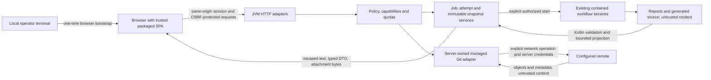

# Browser trust and deployment contract

Design authority: [#149](https://github.com/minsago-elite/decomp_thing/issues/149).
Implementation and qualification belong to D2 and D10; the legacy server does not
yet enforce this contract. Scope and baseline gaps are in [web parity](web-parity.md).

## Data flow and authority

Trusted application resources are build-produced, manifest-verified classpath
assets. Uploaded names/binaries, source, report bodies, logs, agent messages,
commit messages, ref names, remote output and imported repository metadata are
untrusted. A report's hash proves identity, not safe HTML or correct execution.
The browser cannot supply an executable, shell command, arbitrary host path,
environment map, Git configuration directive, archive extraction target or
validation verdict. Kotlin services retain all filesystem/execution/acceptance
authority. Uploaded content is never executed as a negative web test.

## Local session and request boundary

Default binding remains `127.0.0.1`. The local server uses its configured canonical
origin (scheme, exact host, actual port and normalized base path), with explicit
loopback aliases if configured; it never derives authority from request Host or
forwarded headers. Bracketed IPv6 loopback can be an explicit alternative. Reject
unexpected/duplicate Host, malformed authority and cross-origin requests before
looking up jobs. Loopback binding alone does not authorize another website.

At startup, generate a cryptographically random 256-bit single-use bootstrap
token. Print a local URL carrying the token in the fragment, never a query or
path. The operator opens that URL; the SPA removes the fragment with
`history.replaceState` before fetching any content and POSTs the token to
`/api/v1/session`. It has a five-minute expiry and is consumed atomically. Do not
log or persist it, include it in an asset, or leave it in a copied/shareable link.
The public bootstrap page contains no job information. CLI session reissue is an
explicit local operation; unauthenticated HTTP cannot mint a bootstrap token.

A successful exchange returns a fresh opaque session cookie and an independent
CSRF token. Cookie attributes: HttpOnly, SameSite=Strict, path equal to the
configured application base path; Secure is required with HTTPS and omitted only
for the explicit local HTTP profile. Avoid a `Domain` attribute. The server
enforces an eight-hour absolute and thirty-minute idle expiry, revokes sessions
on restart/logout, stores only token digests and uses constant-time comparisons.
The SPA keeps the CSRF token in memory. Reload obtains it from an authenticated
same-origin bootstrap response with `Cache-Control: no-store`, not localStorage.

Every mutation, including cancellation, deletion and Git operations, requires
an authenticated session, exact same Origin, JSON or explicitly allowed multipart
content type, and `X-CSRF-Token`. The token exchange itself requires exact Origin
and `application/json`, but uses the one-time token instead of a session/CSRF
token. Reject `Origin: null`; reject cross-site Fetch Metadata when present.
Do not allow credentialed CORS, wildcard origins or state-changing GETs.

Same-origin navigation, GET/HEAD attachments and event streams use the cookie.
They may omit Origin when normal browser navigation does, but Host must match;
an Origin that is present must match. Apply session checks before streaming any
private bytes. SSE uses same-origin cookies with no secret query parameters.
Downloads expose only authorized artifact IDs, safe attachment names and immutable
revision identity. Public GET/HEAD access is limited to the shell's allowlisted
assets and login page. Unknown methods return 405 with Allow; unsupported body
types return 415; failed session/authorization checks use sanitized 401/403
envelopes. Exact endpoint contracts live in [web API](web-api.md).

Legacy HTML mutation forms and automation routes must pass through the same
authorization services during migration (#161/#230); compatibility is not a
permission bypass. Development proxying is explicitly configured and loopback
only. It preserves public browser origin/session semantics through a reviewed
development adapter; production accepts neither Vite origins nor development
forwarding headers (#155). The dev fixture server has no production credentials.

## Text, files and secrets

The SPA inserts content as text nodes. Source highlighting works on escaped
tokens; no `innerHTML`, executable Markdown, SVG/HTML preview, data-URL document
embedding or automatic external-image loading. Untrusted external links require
explicit user navigation and use `noopener noreferrer`; reject non-HTTP(S)
schemes. Content cannot name JavaScript modules, CSS resources or worker URLs.

Production CSP restricts default/script/style/connect/worker to the application
origin, denies objects, framing and base URI, and limits forms to self. Do not
require inline scripts/styles or `eval`; nonces are only a separately reviewed
exception. Assets, API responses, errors and downloads use `nosniff` and
`Referrer-Policy: no-referrer`. Served source/report/log bytes are plain text or
attachments, including files whose names suggest active content (#176/#189).

Job metadata stores logical IDs and server-relative owned paths. Reopening old
metadata never trusts its stored absolute `binary_path` for authorization. File
services resolve IDs through an immutable manifest beneath an owned job/revision
root, reject symbolic links and escape paths, and retain a consistent file handle
or snapshot during reads. Concurrent rename, replacement, deletion and Git
checkout must not rebind an authorized read to different bytes (#164/#166).

| Data | Browser/persistence policy | Owner |
| --- | --- | --- |
| Provider/Git tokens, cookies, authorization headers, SSH private material, environment secrets | Never in DTOs, UI, errors, fixtures or audit payload; redact before persistent logs as well as live output | #177 #207 |
| Host paths and tool/agent argv | Display logical tool/capability labels; redact absolute roots, usernames and secret arguments; detailed provisioning diagnostics stay in private operator output | #158 #177 #194 |
| Private prompts and model reasoning | Not published by default; bounded approved summaries and provenance IDs only; explicit policy needed before exposing retained content | #69 #177 #178 |
| Security controls | Show capability availability, actionable public reason and configured resource limits; omit session material, private containment paths and internal command lines | #161 #177 #194 |
| Git remote URLs and identity | Display normalized scheme/host/repository label with userinfo and sensitive query components removed; credential handle is opaque | #177 #207 |
| Source/log/report text | User-visible project data, bounded and escaped; control characters and bidi content get visible safe representation where needed | #176 #178 #189 |
| Source maps | Not served or included in release assets; private CI debugging artifacts only with retention/access controls | #157 #232 |

## Default server budgets

All bounds are enforced by the server even if a browser is modified. Exceeding a
budget produces a typed limit result and preserves prior accepted state. Byte
limits apply after decoding as well as on wire where relevant. Values are initial
release requirements, configurable downward; upward changes follow the evidence
review policy in [web delivery](web-delivery.md).

| Boundary | Default | Enforcement and negative-test owner |
| --- | --- | --- |
| Multipart upload request | 32 MiB including framing; one binary part; filename 255 UTF-8 bytes | #162 #208; stream-limit chunked/misdeclared bodies, clean abandoned staging |
| Ordinary JSON request / nesting | 1 MiB / depth 32; bounded field/list schemas | #158 #208; reject duplicate keys and oversized decoded content |
| HTTP execution | 16 workers, 64 waiting requests, 8 active browser sessions | #208; reject admission with 429/503 and bounded Retry-After |
| Request time | 30 s ordinary request; 120 s total upload; 120 s download idle | #162 #166 #208; slow request/disconnect releases resource reservation |
| Workflow execution | 2 workers, 32 queued attempts, 1 active attempt per job | #160 #165 #208; admission atomic across tabs and scheduler rejection |
| Pages | Default 50, maximum 200 rows; response ceiling 1 MiB | #159 #163 #202; opaque snapshot cursor, no full-store rescans per page |
| Source/log read | 256 KiB source chunk / 64 KiB log chunk; response ceiling applies | #178 #189; explicit truncation/next offset, byte-count-safe arithmetic |
| Graph neighborhood | 200 nodes, 400 edges per expansion | #184 #220; return omitted counts or unknown, never silently omit |
| Event connection | 16 streams total, 2 per session; heartbeat 15 s | #174 #208; slow consumers reconcile from snapshot |
| Event persistence | 10,000 records or 16 MiB per run, whichever first; terminal retention 24 h | #174 #172; retention gap marker and current snapshot survive pruning |
| Job storage | 20 GiB total, 2 GiB per job, at most 10,000 visible jobs | #172 #208; reserve before write, account uploads/reports/Git/staging |
| Git process/output | 30 s local read, 120 s local mutation, 10 min network operation; 1 MiB captured text | #202 #208 #209; cancellation reaps processes and preserves operation record |
| Git object transfer | 512 MiB per operation, bounded disk reservation within job quota | #209 #215; limit transport/object growth, expose incomplete operation |
| Audit retention | 30 days or 64 MiB, whichever first; bounded rotation | #177 #172; redact before durable append |

Ordinary request deadlines do not stop an admitted asynchronous workflow; they
bound HTTP processing. The durable operation records workflow-specific execution
limits separately. Session expiry, browser disconnect or server restart never
silently repeats an admitted workflow or remote write.

## Git and remote deployment

Managed repositories/worktrees have server-owned identities and contained roots.
Imported `.git` config, hooks, filters, helpers, submodules, attributes that trigger
execution, and credential configuration cannot run implicitly. The adapter uses
an explicit executable and argv, sanitized environment/config and disabled hooks
and optional protocols; it never accepts shell commands. Status/history access
must be read-only at the application level and cannot trigger a fetch. Remote
operations only use configured permitted transports and credential handles;
URL normalization/redirect policy cannot expand host/filesystem authority.

Staging, commits, checkout, integration, conflict resolution, push, tag publication
and PR creation are separate explicit operations with job/repository/worktree/ref
version guards and audit records. No silent discard, background push, force push
or publication on navigation. Imported or edited source is a candidate requiring
existing validation before acceptance. These are #200–#215 obligations.

Non-loopback deployment is an explicit optional profile under #216. Require TLS
termination, authenticated single-user access, a configured exact external origin
and base path, and an authenticated/isolated connection from the trusted proxy to
the JVM. Reject broader binding without a complete profile. Ignore forwarded
headers except from the configured proxy peer; strip inbound spoofed identity
headers there. Public authenticated mode retains CSRF, file containment, quotas
and redaction. The local bootstrap must not be printed as a remotely usable
credential. Multi-tenant authorization remains outside this release.

## Privacy, deletion and review evidence

No telemetry, automatic external fonts, crash-report upload or background remote
sync. Non-sensitive preferences may remain in browser storage; clearing them
cannot delete jobs. Deletion is a deliberate, version-guarded lifecycle operation
with a recoverable tombstone and configured retention. Active attempts, open
snapshots and accepted archive references block physical deletion until leases
end. Cleanup is bounded, auditable and restart-safe (#172/#173). Audit records
include actor/session digest, request/operation ID, action, logical resource IDs,
decision and time, without source bodies or credentials.

Qualification uses isolated benign fixtures for foreign Host/Origin, expired and
reused bootstrap tokens, missing CSRF, concurrent requests, active-looking source
text, malformed files, local link replacement, redaction sentinels, disk limits,
slow consumers and imported disabled Git config. Assertions inspect denied
operations and unchanged owned state; fixtures never execute uploaded binaries
or imported hooks. Review the actual packaged server, not only a fixture handler
(#161/#164/#176/#177/#208/#216/#224/#225).
