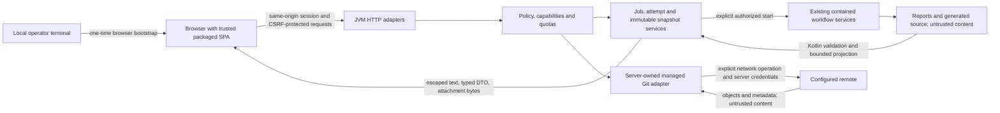

# Browser trust and deployment contract

Design authority: [#149](https://github.com/minsago-elite/decomp_thing/issues/149).
Implementation and qualification belong to D2 and D10. Both browser presentations now
use the local session/request boundary; the broader contract remains partly unimplemented.
Current access findings are in the [access audit](web-access-boundary-audit.md); historical
scope and baseline gaps are in [web parity](web-parity.md).

## Data flow and authority

Trusted application resources are build-produced, manifest-verified classpath
assets. Uploaded names/binaries, source, report bodies, logs, agent messages,
commit messages, ref names, remote output and imported repository metadata are
untrusted. A report's hash proves identity, not safe HTML or correct execution.
The browser cannot supply an executable, shell command, arbitrary host path,
environment map, Git configuration directive, archive extraction target or
validation verdict. Kotlin services retain all filesystem/execution/acceptance
authority. Uploaded content is never executed as a negative web test.

## Local session and request boundary

Default binding remains `127.0.0.1`. The local server uses its configured canonical
origin (scheme, exact host, actual port and normalized base path), with explicit
loopback aliases if configured; it never derives authority from request Host or
forwarded headers. Bracketed IPv6 loopback can be an explicit alternative. Reject
unexpected/duplicate Host, malformed authority and cross-origin requests before
looking up jobs. Loopback binding alone does not authorize another website.

At startup, generate a cryptographically random 256-bit single-use bootstrap
token. Print a local URL carrying the token in the fragment, never a query or
path. The operator opens that URL; the browser login removes the fragment with
`history.replaceState` before fetching any content and POSTs the token to
`/api/v1/session`. It has a five-minute expiry and is consumed atomically. Do not
log or persist it, include it in an asset, or leave it in a copied/shareable link.
The public bootstrap page contains no job information. CLI session reissue is an
explicit local operation; unauthenticated HTTP cannot mint a bootstrap token.

A successful exchange returns a fresh opaque session cookie and an independent
CSRF token. Cookie attributes: HttpOnly, SameSite=Strict, path equal to the
configured application base path; Secure is required with HTTPS and omitted only
for the explicit local HTTP profile. Avoid a `Domain` attribute. The server
enforces an eight-hour absolute and thirty-minute idle expiry with monotonic time,
revokes sessions on restart/logout, stores only domain-separated SHA-256 token
digests and uses constant-time comparisons. A process-only random HMAC key derives
the opaque CSRF token from `decomp-web-csrf-v1`, a zero-byte separator and the
authenticated session cookie. This keeps the CSRF token stable across reloads and
tabs without retaining its plaintext; neither the key nor session state is persisted.
The SPA keeps the CSRF token in memory. Reload obtains it from an authenticated
same-origin bootstrap response with `Cache-Control: no-store`, not localStorage.

Every mutation, including cancellation, deletion and Git operations, requires
an authenticated session, exact same Origin, JSON or explicitly allowed multipart
content type, and `X-CSRF-Token`. The token exchange itself requires exact Origin
and `application/json`, but uses the one-time token instead of a session/CSRF
token. Reject `Origin: null`; reject cross-site Fetch Metadata when present.
Do not allow credentialed CORS, wildcard origins or state-changing GETs.

Same-origin navigation, GET/HEAD attachments and event streams use the cookie.
They may omit Origin when normal browser navigation does, but Host must match;
an Origin that is present must match. Apply session checks before streaming any
private bytes. SSE uses same-origin cookies with no secret query parameters.
Downloads expose only authorized artifact IDs, safe attachment names and immutable
revision identity. Public GET/HEAD access is limited to the shell's allowlisted
assets and login page. Unknown methods return 405 with Allow; unsupported body
types return 415; failed session/authorization checks use sanitized 401/403
envelopes. Exact endpoint contracts live in [web API](web-api.md).

Legacy HTML mutation forms and automation routes must pass through the same
authorization services during migration (#161/#230); compatibility is not a
permission bypass. Development proxying is explicitly configured and loopback
only. It preserves public browser origin/session semantics through a reviewed
development adapter; production accepts neither Vite origins nor development
forwarding headers (#155). The dev fixture server has no production credentials.

## Text, files and secrets

The SPA inserts content as text nodes. Source highlighting works on escaped
tokens; no `innerHTML`, executable Markdown, SVG/HTML preview, data-URL document
embedding or automatic external-image loading. Untrusted external links require
explicit user navigation and use `noopener noreferrer`; reject non-HTTP(S)
schemes. Content cannot name JavaScript modules, CSS resources or worker URLs.

Production CSP restricts default/script/style/connect/worker to the application
origin, denies objects, framing and base URI, and limits forms to self. Do not
require inline scripts/styles or `eval`; nonces are only a separately reviewed
exception. Assets, API responses, errors and downloads use `nosniff` and
`Referrer-Policy: no-referrer`. Served source/report/log bytes are plain text or
attachments, including files whose names suggest active content (#176/#189).

Job metadata stores logical IDs and server-relative owned paths. Reopening old
metadata never trusts its stored absolute `binary_path` for authorization. File
services resolve IDs through an immutable manifest beneath an owned job/revision
root, reject symbolic links and escape paths, and retain a consistent file handle
or snapshot during reads. Concurrent rename, replacement, deletion and Git
checkout must not rebind an authorized read to different bytes (#164/#165).

| Data | Browser/persistence policy | Owner |
| --- | --- | --- |
| Provider/Git tokens, cookies, authorization headers, SSH private material, environment secrets | Never in DTOs, UI, errors, fixtures or audit payload; redact before persistent logs as well as live output | #177 #207 |
| Host paths and tool/agent argv | Display logical tool/capability labels; redact absolute roots, usernames and secret arguments; detailed provisioning diagnostics stay in private operator output | #166 #177 #194 |
| Private prompts and model reasoning | Not published by default; bounded approved summaries and provenance IDs only; explicit policy needed before exposing retained content | #69 #177 #178 |
| Security controls | Show capability availability, actionable public reason and configured resource limits; omit session material, private containment paths and internal command lines | #161 #177 #194 |
| Git remote URLs and identity | Display normalized scheme/host/repository label with userinfo and sensitive query components removed; credential handle is opaque | #177 #207 |
| Source/log/report text | User-visible project data, bounded and escaped; control characters and bidi content get visible safe representation where needed | #176 #178 #189 |
| Source maps | Not served or included in release assets; private CI debugging artifacts only with retention/access controls | #157 #232 |

## Default server budgets

All bounds are enforced by the server even if a browser is modified. Exceeding a
budget produces a typed limit result and preserves prior accepted state. Byte
limits apply after decoding as well as on wire where relevant. Values are initial
release requirements, configurable downward; upward changes follow the evidence
review policy in [web delivery](web-delivery.md).

| Boundary | Default | Enforcement and negative-test owner |
| --- | --- | --- |
| Multipart upload request | 32 MiB including framing; one binary part; filename 255 UTF-8 bytes | #162 #208; stream-limit chunked/misdeclared bodies, clean abandoned staging |
| Ordinary JSON request / nesting | 1 MiB / depth 32; bounded field/list schemas | #158 #208; reject duplicate keys and oversized decoded content |
| HTTP execution | 16 workers, 64 waiting requests, 8 active browser sessions | #208; reject admission with 429/503 and bounded Retry-After |
| Request time | 30 s ordinary request; 120 s total upload; 120 s download idle | #162 #165 #208; slow request/disconnect releases resource reservation |
| Workflow execution | 2 workers, 32 queued attempts, 1 active attempt per job | #160 #163 #208; admission atomic across tabs and scheduler rejection |
| Pages | Default 50, maximum 200 rows; response ceiling 1 MiB | #162 #165 #202; opaque snapshot cursor, no full-store rescans per page |
| Source/log read | 256 KiB source chunk / 64 KiB log chunk; response ceiling applies | #178 #189; explicit truncation/next offset, byte-count-safe arithmetic |
| Graph neighborhood | 200 nodes, 400 edges per expansion | #184 #220; return omitted counts or unknown, never silently omit |
| Event connection | 16 streams total, 2 per session; heartbeat 15 s | #174 #208; slow consumers reconcile from snapshot |
| Event persistence | 10,000 records or 16 MiB per run, whichever first; terminal retention 24 h | #174 #172; retention gap marker and current snapshot survive pruning |
| Job storage | 20 GiB total, 2 GiB per job, at most 10,000 visible jobs | #172 #208; reserve before write, account uploads/reports/Git/staging |
| Git process/output | 30 s local read, 120 s local mutation, 10 min network operation; 1 MiB captured text | #202 #208 #209; cancellation reaps processes and preserves operation record |
| Git object transfer | 512 MiB per operation, bounded disk reservation within job quota | #209 #215; limit transport/object growth, expose incomplete operation |
| Audit retention | 30 days or 64 MiB, whichever first; bounded rotation | #177 #172; redact before durable append |

Ordinary request deadlines do not stop an admitted asynchronous workflow; they
bound HTTP processing. The durable operation records workflow-specific execution
limits separately. Session expiry, browser disconnect or server restart never
silently repeats an admitted workflow or remote write.

## Git and remote deployment

Managed repositories/worktrees have server-owned identities and contained roots.
Imported `.git` config, hooks, filters, helpers, submodules, attributes that trigger
execution, and credential configuration cannot run implicitly. The adapter uses
an explicit executable and argv, sanitized environment/config and disabled hooks
and optional protocols; it never accepts shell commands. Status/history access
must be read-only at the application level and cannot trigger a fetch. Remote
operations only use configured permitted transports and credential handles;
URL normalization/redirect policy cannot expand host/filesystem authority.

Staging, commits, checkout, integration, conflict resolution, push, tag publication
and PR creation are separate explicit operations with job/repository/worktree/ref
version guards and audit records. No silent discard, background push, force push
or publication on navigation. Imported or edited source is a candidate requiring
existing validation before acceptance. These are #200–#215 obligations.

Non-loopback deployment is an explicit optional profile under #216. Require TLS
termination, authenticated single-user access, a configured exact external origin
and base path, and an authenticated/isolated connection from the trusted proxy to
the JVM. Reject broader binding without a complete profile. Ignore forwarded
headers except from the configured proxy peer; strip inbound spoofed identity
headers there. Public authenticated mode retains CSRF, file containment, quotas
and redaction. The local bootstrap must not be printed as a remotely usable
credential. Multi-tenant authorization remains outside this release.

## Privacy, deletion and review evidence

No telemetry, automatic external fonts, crash-report upload or background remote
sync. Non-sensitive preferences may remain in browser storage; clearing them
cannot delete jobs. Deletion is a deliberate, version-guarded lifecycle operation
with a recoverable tombstone and configured retention. Active attempts, open
snapshots and accepted archive references block physical deletion until leases
end. Cleanup is bounded, auditable and restart-safe (#172/#173). Audit records
include actor/session digest, request/operation ID, action, logical resource IDs,
decision and time, without source bodies or credentials.

Qualification uses isolated benign fixtures for foreign Host/Origin, expired and
reused bootstrap tokens, missing CSRF, concurrent requests, active-looking source
text, malformed files, local link replacement, redaction sentinels, disk limits,
slow consumers and imported disabled Git config. Assertions inspect denied
operations and unchanged owned state; fixtures never execute uploaded binaries
or imported hooks. Review the actual packaged server, not only a fixture handler
(#161/#164/#176/#177/#208/#216/#224/#225).

## Legacy transport checkpoint

Both UI modes now require loopback binding. Legacy startup rejects non-loopback configuration
before opening the server socket or acquiring job storage; a remotely exposed legacy profile
is not qualified. Legacy requests pass through the same `LocalWebAccess` transport preflight
as v1 routing: exact configured Host/Origin pairing, bounded headers, forwarded-header rejection
and same-origin/none Fetch Metadata when present. This covers pages, JSON, downloads and
mutation routes before their handlers run. No permissive CORS headers are added.

This preflight is not session authorization. Legacy requests still do not require the SPA
session/CSRF token, and absent Origin remains accepted by the transport-only policy, including
non-browser requests. Legacy bootstrap/session and form/automation migration remain open.
The existing SPA private/mutation policy continues to enforce its stronger session and CSRF
requirements after transport validation. Do not describe legacy mode as authenticated.

HTTP regression cases use benign read and empty mutation requests with foreign Origin,
cross-site Fetch Metadata and forwarding headers, checking denial across routes, unchanged job
bytes and zero workflow callback executions. Matching/absent Origin reads remain compatible.
Non-loopback startup is tested against an absent storage root. Host parsing/alias behavior is
shared with the existing access-policy suite; this checkpoint does not add a remote proxy profile.

The [packaged legacy browser report](evidence/web-legacy-transport-browser-20260905.json)
passes with this preflight enabled: local navigation/reload/polling and missing/empty/restored
journal recovery work without page exceptions. The report discloses test-owned fixture edits,
GET/HEAD-only browser requests, unchanged installation and confirmed shutdown/cleanup. Chrome
used test-only `--no-sandbox`; no workflow ran. This is recorded Linux/Chrome compatibility,
not a session/CSRF or remote-access qualification.

## Legacy mutation Origin requirement

Legacy POST `/jobs`, `/jobs/J/explore` and `/jobs/J/reconstruct` now require an Origin header
before dispatch. The shared transport preflight first checks that a supplied origin exactly
matches the configured local authority; the mutation check rejects absence with 403
`ORIGIN_DENIED`. Browser form submissions and same-origin fetches supply this header. Existing
non-browser legacy clients must explicitly send the configured origin to continue using these
routes. Reads may still omit Origin for normal navigation.

This closes the missing-Origin mutation gap, not the legacy session/CSRF gap: possession of
a matching origin string is not authentication. The local session bootstrap, authenticated
legacy reads/forms and appropriate CSRF protection remain required before #161 is complete.
HTTP tests now use a client that sends Origin without silently filtering it; they cover absent
and mismatched Origin denial before upload/workflow handlers, with unchanged job bytes and
zero denied workflow invocations. Existing allowed upload/admission/shutdown cases continue
with the exact origin and retain their previous behavior.

## Shared session controller prerequisite

Session POST/DELETE handling now lives in `WebSessionController`, which depends only on
`LocalWebAccess`. The SPA router delegates to it; the versioned response envelope, bounded
serialization, request IDs and no-store headers are shared with other API responses. This
allows the legacy router to adopt the same session exchange/logout implementation without
loading SPA assets or introducing a second cookie/CSRF implementation.

The standalone HTTP regression uses no assets or job service. It verifies that invalid
method/origin/query/Accept requests do not consume the bootstrap token, a created session
authorizes reads through the same access instance, logout requires CSRF, and successful logout
revokes access. The existing SPA and legacy web/journal regression suite also passes.
This extraction does not yet expose session routes or enforce session/CSRF in legacy mode;
legacy form, CLI bootstrap and packaged-browser migration remain outstanding under #161.

## Authenticated legacy presentation

Legacy mode now requires the same local session for job pages, JSON polling, source views,
artifact downloads and namespace misses. Only `/login` and the stylesheet are public reads.
The CLI prints an explicit `/login#bootstrap=…` handoff in legacy mode; login clears the
fragment before exchanging it through the shared `POST /api/v1/session` handler. The public
login page contains no job metadata. Unauthenticated HTML navigation receives that page with
401, while JSON APIs return a typed denial. This supersedes the transport-only limitations
in the earlier checkpoints above.

Legacy forms intercept submission and restore CSRF through authenticated, no-store
`GET /api/v1/session/csrf`. The token stays in document memory. Uploads remain multipart;
explore/reconstruct POSTs use JSON content type. All mutations require exact Origin, a valid
session cookie and CSRF. Non-browser clients must exchange the operator bootstrap token and
send those credentials explicitly. Failed mutations are not automatically retried. The
End session button calls the shared CSRF-protected DELETE handler and clears the local view.
Normal navigation/reload and file download use the HttpOnly cookie without tokens in links.

The session restoration endpoint uses the v1 `session` envelope (`csrfToken`, `expiresAt`),
rejects query parameters and requires JSON Accept. It is a legacy presentation adapter;
SPA restoration continues through its existing bootstrap endpoint. Expired-cookie clearing
and denial headers are shared with the v1 error responder. Remote access remains unavailable
until its profile is qualified; this change does not complete all #161 acceptance criteria.

Qualification at source `ef068ef`: 178 web/journal tests and distZip pass. The retained
[legacy browser report](evidence/web-legacy-session-browser-20260905.json) proves denied
unauthenticated views, fragment removal before exchange, authenticated form upload of a
64-byte inert ELF header, polling/reload/recovery, a session-authorized artifact read and
logout revocation of APIs/downloads. The uploaded job stays uploaded; no workflow executes.
The [SPA session regression](evidence/web-legacy-session-spa-regression-20260905.json) passes
on the same archive. Both reports identify archive/JAR/browser hashes, test-only
`--no-sandbox`, unchanged installation and confirmed shutdown/cleanup. Legacy fixture edits
and the test-only fetch guard are disclosed. Browser expiry, peer-tab clearing and remote
profile qualification are not established by these runs.

## Legacy session invalidation and private-page lifetime

Legacy documents now restore session expiry on load and when visible again. The returned
expiry schedules local invalidation; a 401 from any session-managed request invalidates
immediately. Invalidation erases CSRF, aborts pending requests, clears private body/title
and returns to `/login`. Polling checks document activity before rendering and scheduling
another request, so a late successful response cannot repopulate an invalidated view.
Page departure clears private DOM; a persisted history restoration goes to login.

Confirmed logout also sends the same deployment-scoped, credential-free invalidation hint
used by the SPA (`decomp-session-v1:/` in root-only legacy mode). A peer validates the closed
message shape, clears its page and issues no logout request. BroadcastChannel is optional:
without it, active polling learns revocation from 401 and an idle document rechecks when
visible or clears at its known expiry. Notification delivery and background timer timing
are browser-dependent; the server remains the authority for every request.

Run `node --test scripts/legacy-session.test.mjs` with the pinned Node to verify the actual
embedded script's expiry handling, late-response rejection, peer message validation,
confirmed logout, 401 handling and history-cache lifecycle. These deterministic tests use
a browser model and controlled responses/timers; they do not claim real elapsed server
expiry or browser history-cache qualification.

The [packaged legacy invalidation report](evidence/web-legacy-session-invalidation-20260905.json)
at source `f9ec0fd` proves an idle peer clears through notification and an active peer with
BroadcastChannel disabled clears on an actual server 401 after logout. Neither peer issues
a mutation. Existing login/upload/download/polling/recovery checks also pass. The report
retains artifact identities, explicit test fixture edits, test-only browser sandbox override,
unchanged installation and confirmed cleanup. It does not establish real elapsed expiry.
